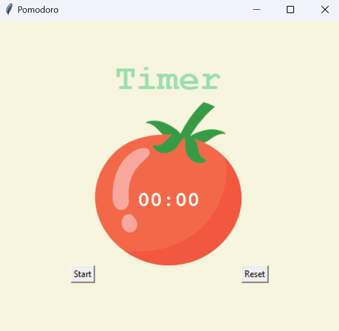
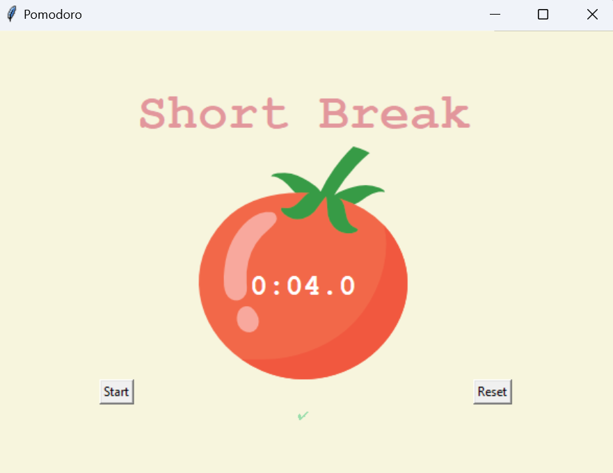
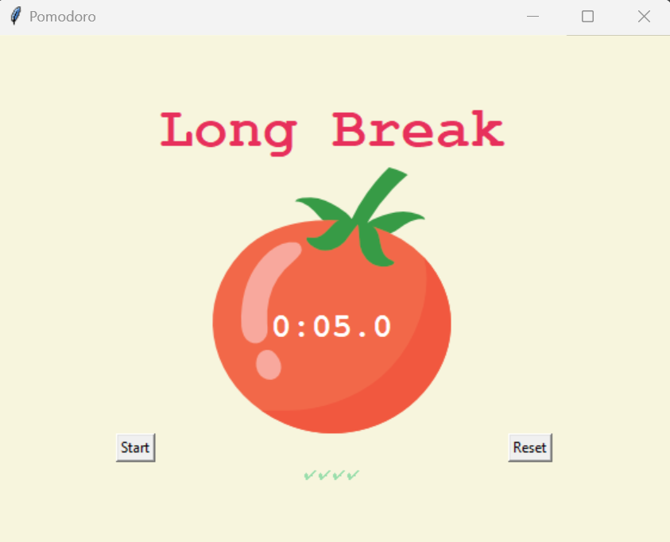

# Pomodoro Timer Application 🍅⏱️

The **Pomodoro Timer Application** is a productivity tool designed to implement the Pomodoro Technique. This time management method alternates focused work sessions with short breaks to boost productivity and maintain mental clarity. The application is built using Python's `tkinter` library and features an intuitive graphical user interface.

## 🚀 Features
- **Customizable Work and Break Intervals:**
  - Work session: 25 minutes.
  - Short break: 5 minutes.
  - Long break: 20 minutes (after every four work sessions).
- **Visual Timer:** A dynamic timer with a tomato icon shows the remaining time.
- **Session Tracking:** Completed work sessions are visually represented with checkmarks.
- **Reset Functionality:** Easily reset the timer and session tracking with a single click.

## 🎮 How to Use
1. Launch the application by running the `main.py` file.
2. Click the **Start** button to begin a work session.
3. After 25 minutes, the timer will automatically transition to a 5-minute break.
4. After four work sessions, the timer will initiate a 20-minute long break.
5. Click the **Reset** button to reset the timer and progress.

## 📷 Screenshots
### Main Timer Interface:

### Work Session:

### Short Break:

### Long Break:

